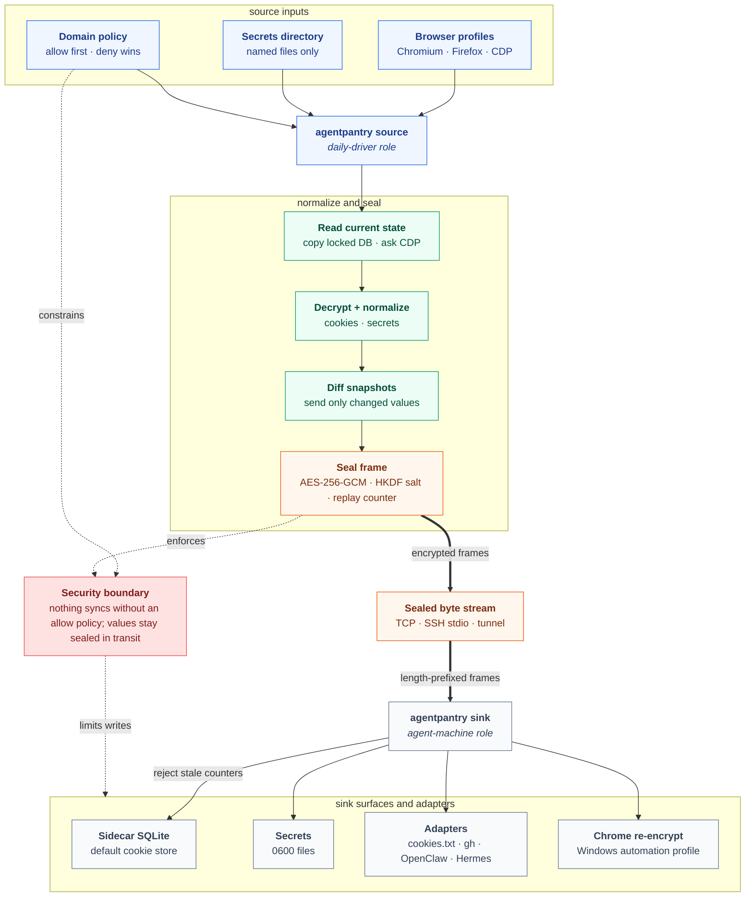

  

<h1 align="center">Agent Pantry</h1>

<strong>Authenticated sessions for agent machines.</strong>

  <strong>Website:</strong> <a href="https://agentpantry.escoffierlabs.dev">agentpantry.escoffierlabs.dev</a>

  
  
  
  
  

Keep your agent's machine authenticated. Agent Pantry (`agentpantry`) is a
secure browser session and secret sync CLI for AI agents. It mirrors selected
cookies, browser auth state, and named secrets from your daily-driver (source)
to the machine your agent runs on (sink), whether that is Codex, Claude Code,
OpenClaw, Hermes Agent, or a custom runner. Unlike a password manager or a
hosted secret store, it is a single local Go binary that moves nothing until you
allow a domain, seals every diff in an AES-256-GCM frame with replay protection,
and writes only to the surfaces you turn on, so automation can use tools that
expect local auth state.

In kitchen terms: the pantry is where the chef stores the cookies and the
secret recipes.

  

<em>Set up the agent machine in four commands: write a config, generate the pre-shared key, validate, and check status. Nothing secret reaches the terminal: `keygen` reports only that a 32-byte key was written, and `status` shows counts and `key_present`, never values. From there `source` and `sink` stream cookie and secret diffs sealed with AES-256-GCM.</em>

Agent Pantry is part of the [Brigade](https://github.com/escoffier-labs/brigade)
fleet from Escoffier Labs: small, composable agent-ops tools that help agent
runtimes work with real local environments. It is still a standalone
MIT-licensed CLI; you can use it without Brigade or any other Escoffier Labs
tool.

## What it does

Agent Pantry keeps an AI agent's machine authenticated by syncing browser
cookies, browser auth state, and named secrets from your daily driver to the
agent's machine over an encrypted link. You run the `source` role on the machine
where you actually log in and the `sink` role on the agent's machine. The source
watches the browser cookie store, decrypts and normalizes the cookies, filters
them through a domain allow/deny policy, diffs against the last snapshot so only
changes move, and seals each diff in an AES-256-GCM frame carrying a monotonic
replay counter. The sink rejects any stale frame and applies the diff to the
surfaces you enable: a default plaintext sidecar SQLite store, opt-in secrets and
browser stores, or native adapters for Netscape `cookies.txt`, the GitHub CLI,
OpenClaw provider profiles, and a Hermes Agent bundle. Nothing syncs until you
add a domain to the allow list, and cookie and secret values are never logged.

## Install

    go install github.com/escoffier-labs/agentpantry/cmd/agentpantry@latest

Confirm the installed binary:

    agentpantry version

Or install a release archive:

    VERSION=v0.4.0
    OS=linux
    ARCH=amd64
    curl -LO "https://github.com/escoffier-labs/agentpantry/releases/download/${VERSION}/agentpantry_${VERSION}_${OS}_${ARCH}.tar.gz"
    curl -LO "https://github.com/escoffier-labs/agentpantry/releases/download/${VERSION}/checksums.txt"
    sha256sum -c checksums.txt --ignore-missing
    tar -xzf "agentpantry_${VERSION}_${OS}_${ARCH}.tar.gz"
    install -m 0755 "agentpantry_${VERSION}_${OS}_${ARCH}/agentpantry" ~/.local/bin/agentpantry

## Quickstart

### On the sink (agent machine)
    agentpantry init --role sink
    agentpantry keygen
    # copy ~/.config/agentpantry/psk.key to the source machine
    # edit config.toml: set peer to the bind address, e.g. 0.0.0.0:8787 over your VPN
    agentpantry doctor
    agentpantry sink

### On the source (daily driver)
    agentpantry init --role source
    # copy the psk.key from the sink into ~/.config/agentpantry/psk.key
    # edit config.toml: set peer to the sink address, add a [[browsers]] block and allow domains
    agentpantry doctor
    agentpantry source

`init` writes a commented config that walks through each field (it refuses to
overwrite an existing config unless you pass `--force`), and `doctor` validates
the result before you rely on it, warning about misspelled or misplaced config
keys instead of ignoring them.

A `[[browsers]]` entry takes a `kind`: `chromium` (Chrome, Chromium, Brave, Edge;
decrypted via the Secret Service with a `peanuts` fallback) or `firefox` (reads
plaintext cookies from the profile's `cookies.sqlite`, so no keyring is needed).
Point `cookie_path` at the profile's cookie store. A source configured with only
Firefox browsers skips the keyring check in `agentpantry doctor`.

On Windows, `kind = "chromium"` decrypts `v10` cookies using the DPAPI-unwrapped
key from the profile's `Local State`. `agentpantry install-service` on Windows
prints a Scheduled Task command (agentpantry is a console app, so it runs as a
logon task rather than an SCM service). A Windows sink supports the sidecar,
secrets, and adapter surfaces, plus the real-Chrome re-encrypt surface described
next.

A Windows sink can also use the real-Chrome re-encrypt surface (`chrome`): it
writes synced cookies into the target Chrome Cookies store as `v10` AES-256-GCM,
encrypted with the sink's own DPAPI-unwrapped key. Use it against a not-running,
pre-app-bound, or dedicated automation profile; an app-bound (version 127+)
profile may prefer `v20`, so v10 writes are best treated as a legacy/automation
path.

For app-bound Chrome (version 127+, `v20` cookies) where the key is no longer
recoverable from `Local State`, use `kind = "cdp"`: launch Chrome with
`--remote-debugging-port=9222` (bound to loopback, ideally a dedicated automation
profile) and set `url = "http://127.0.0.1:9222"` on the browser entry. agentpantry
asks Chrome for the cookies over the DevTools Protocol, so Chrome performs its own
authorized decryption. The debugging port grants full browser control, so keep it
on loopback and treat it as sensitive. A `cdp` reader syncs at startup, on
other browsers' file events, and on the `resync_seconds` poll, which defaults
to 60 seconds for a CDP source when unset. For an operator-export run that
should refresh the sink once and return control to a wrapper, run
`agentpantry source --once`: it reads the CDP source, applies the same policies,
updates source state, closes the connection, and exits 0 after a successful
initial sync.

Both ends must hold the same pre-shared key. Generate it once on the sink with
`agentpantry keygen` and copy the file to the source. Run `agentpantry status`
on either machine to print the active role, peer, key path, surfaces, and the
configured allow/deny domains. To run the source or sink as a persistent
background service, use `agentpantry install-service`, which writes a systemd
user unit and prints the commands to enable it.

The `examples/` directory has copyable source and sink configs for Chromium,
Firefox, CDP, local script-driven captures, Hermes Agent, GitHub CLI, OpenClaw,
and SSH stdio transport.

## How it works

agentpantry is a single binary that takes on one of two roles, chosen by
subcommand.

The source runs on your daily driver. It watches the Chromium cookie store for
changes, copies the locked SQLite file to a temporary path, and decrypts each
value using the keyring passphrase from the freedesktop Secret Service (falling
back to Chromium's fixed "peanuts" key when no keyring is present). The
decrypted cookies are normalized into a snapshot, filtered through your domain
allow/deny policy, and diffed against the last snapshot so only changes move.
Each diff is JSON-encoded, sealed in an AES-256-GCM frame carrying a monotonic
replay counter, and written length-prefixed onto a stream.

The sink runs on your agent's machine. It opens each frame, rejects any frame
whose counter is not strictly greater than the last accepted one, and applies
the diff to its configured surfaces. The default sink surface is a plaintext
sidecar SQLite database that holds the current cookie set; opt-in surfaces and
adapters can also write secrets, browser stores, Netscape cookie files, GitHub
CLI auth, OpenClaw provider profiles, and a Hermes Agent bundle.

### Source-to-sink flow

The transport is just a byte stream, so the link can be a TCP connection over a
trusted network or a piped stdio channel through a tunnel. The encryption and
framing do not care which.

## Operating

`agentpantry doctor` checks a configuration before you rely on it. It verifies
that the pre-shared key exists, is 32 bytes, and is mode 0600, that the role
and peer are well formed, and that the role-specific pieces are in place: on a
source it confirms each browser cookie store and the secrets directory are
readable, and on a sink it confirms the bind address is loopback (warning if
not), and that each configured surface is satisfiable. On a source it also
dials the peer to confirm reachability; pass `--no-net` to skip that or
`--timeout` to change the dial timeout. A source config may set
`peer = "none"` for a local script-driven deployment with no long-running
network peer; doctor reports that as an `OK` peer row and skips the dial.
Sink configs cannot use that sentinel. Each check prints `OK`, `WARN`, or
`FAIL`. doctor exits 0 when nothing failed and exits 1 when any check is a
`FAIL` (warnings do not fail the run), so it can gate a startup script. Pass
`--json` for a machine-readable payload with check rows, fail/warn counts, and a
safe config summary for operator dashboards such as Brigade.

`agentpantry status` reports the active role, peer, key path, surfaces, and the
configured allow/deny domains. It also reports the last sync: the time of the
most recent successful source cycle and the cookie and secret counts in the
last frame that was sent, or `never` if the source has not run yet. Pass
`--json` for machine-readable output.

`agentpantry inventory` reads a sidecar backup store and summarizes what it
holds: the total cookie count, the persistent vs session-only split, a per-host
breakdown sorted by count, and the auth cookies that are near expiry. Where
`status` reports config and a last-sync count, `inventory` reads the store
itself, so you can see what a backup actually contains without querying the
SQLite schema by hand. Point it at a store with `--store` (default
`<config dir>/sidecar.db`), set the near-expiry window with `--expiry-days`
(default 14), and pass `--json` for a payload that downstream tools and
dashboards can consume. It reports on existing stores only: if the path does not
exist it exits 2 rather than create an empty one.

The transport can ride an SSH channel instead of a TCP listener. Run the source
with `--stdio` to stream sealed frames to stdout, and the sink with `--stdio` to
read them from stdin, then connect the two over SSH:

    agentpantry source --stdio | ssh sink.example agentpantry sink --stdio

In `--stdio` mode the source never dials the peer and the sink never binds a
port, so the encrypted link exists only inside the SSH channel. The same key
and framing apply.

For same-box captures driven by an external scheduler, use separate per-profile
source and sink config files and pass each path with `-config` from the script.
Set `peer = "none"` only on those source configs so `agentpantry doctor` can
validate the local setup without requiring a listener. Do not run
`agentpantry source` with that config; the scheduler is responsible for driving
each explicit capture pair.
For a one-shot stdio export, add `--once` on the source side:

    agentpantry source --once --stdio | ssh sink.example agentpantry sink --stdio

`--once` is useful in scripts because the source exits on its own after the
initial sync succeeds. Do not wrap a normal long-running `agentpantry source`
in `timeout` just to force it to stop: a healthy run killed by `timeout` exits
as 124, which can look like an agentpantry failure. Use `source --once` when
the expected result is "sync once, then exit."

## Hardening

The transport begins each connection with a session-salt handshake (the sink
issues a fresh random salt over TCP; the source issues it over `--stdio`) and
derives a per-session AES-256 key from the pre-shared key via HKDF, so a frame
captured from one session cannot be replayed into another. Secret syncing can be
narrowed with a `[secret_names]` allow/deny policy (exact names; deny overrides
allow; an empty allow permits everything in the `secrets_dir`). `make gosec`
runs the security scanner, `make vuln` runs govulncheck, and
`make fuzz PKG=... FUZZ=...` runs the fuzz targets for the untrusted-input
parsers.

### Rotating the pre-shared key

`agentpantry rotate-key` rotates the key with no sync downtime. Run it on the
sink: it writes a fresh `psk.key` and preserves the previous key beside it as
`psk.key.old`. The sink accepts new connections under either key (and logs a
warning when a peer still uses the old one), so the source keeps syncing while
you distribute the new key:

    agentpantry rotate-key            # on the sink
    # copy the new psk.key to the source over a secure channel
    # restart the source, or let it reconnect
    agentpantry rotate-key -finish    # on the sink, retires psk.key.old

`doctor` and `status` show a rotation in progress, and a running sink picks up
the rotation without a restart. Finish promptly: until `-finish`, a holder of
the old key is still accepted. `keygen` remains the blunt instrument; it backs
up an existing key beside itself as `psk.key.bak.<timestamp>` before replacing
it (pass `--backup=false` to skip that), but unlike `rotate-key` the sink
accepts only the new key from that moment on. Delete `psk.key.bak.*` files once
a rotation is confirmed, especially one prompted by suspected key exposure:
they hold retired key material.

## Reliability

A TCP source reconnects automatically with capped backoff (1s up to 30s) if the
sink restarts or the link drops, and resends its full current state on each
reconnect. Set `resync_seconds` to have the source periodically re-sync on a
timer in addition to filesystem events (covers any missed event); a `kind=cdp`
source, which has no file to watch, defaults to a 60s poll when `resync_seconds`
is unset. `agentpantry source --once` uses the same initial connect, salt
handshake, read, diff, send, and state-update path, then closes the stream and
exits. It does not start the filesystem watcher, reconnect loop, or resync
timer. Dial, handshake, or initial sync failures return a nonzero exit status.

## Surfaces

The sink applies each synced diff to one or more surfaces, chosen by the
`surfaces` list in the sink config.

- `sidecar` (always available): a plaintext sidecar SQLite database holding the
  current cookie set, written mode 0600. This is the default and safest target.
- `chrome` (opt-in, fragile): writes synced cookies directly into an existing
  Chrome Cookies SQLite, re-encrypting each value with the sink machine's own
  keyring key. The table schema is introspected at open time so it tolerates
  Chrome version differences. This surface targets a profile that is not
  running. Writing a live profile is unsupported, and Chrome may ignore or
  overwrite the rows. It requires a `[[browsers]]` entry whose `cookie_path`
  points at the target store.
- `secrets`: writes synced secrets as individual files under the configured
  secrets directory, one file per secret, mode 0600.

Example sink config selecting multiple surfaces:

    role = "sink"
    peer = "127.0.0.1:8787"
    surfaces = ["sidecar", "secrets"]
    secrets_dir = "/home/agent/.config/agentpantry/secrets"

## Secrets

Beyond cookies, agentpantry can mirror a directory of secrets from source to
sink in the same encrypted frame. On the source, set `secrets_dir` to a
directory and each regular file becomes one secret (the file name is the secret
name, the file contents are the value). Dotfiles and subdirectories are skipped.

Instead of (or alongside) a plaintext directory, the source can read named
secrets straight from an encrypted KeePass vault:

    keepass_path = "/home/you/vault.kdbx"
    keepass_keyfile = "/home/you/.config/agentpantry/vault.key"
    # keepass_pass_file = "..."   # only for password+keyfile vaults
    # keepass_tag = "agentpantry" # the default

Only entries carrying the `keepass_tag` tag are exported (entry Title becomes
the secret name, Password the value), so tagging is the opt-in: the rest of
the vault never leaves the machine. `[secret_names]` still applies on top.
Untagging an entry propagates as a delete on the sink. Unlock is
non-interactive via a 0600 key file (add one in KeePassXC under Database
Security), so the source runs headless. If the same name comes from both
`secrets_dir` and the vault, pick one source per name; the merge order is
otherwise unspecified. A vault that is temporarily unreadable leaves
already-synced secrets on the sink untouched for that cycle.

On the sink, enable the `secrets` surface and set `secrets_dir` to the
destination. Each secret is written as a 0600 file named after the secret.
Secret names are sanitized on the sink: any name containing a path separator,
a `..` element, or an absolute path is skipped rather than written outside the
secrets directory.

Cookies and secrets travel together inside one AES-256-GCM frame, so a single
peer connection carries both.

## Adapters

Adapters are extra sink surfaces that write synced data into the native file a
specific CLI or agent harness already reads, so the tool wakes up authenticated
without any agentpantry-aware glue. They are declared with an optional
`[[adapters]]` block in the sink config, each entry chosen by `type`. An adapter
is layered on top of the regular `surfaces` list; you can run both at once.

Four adapter types ship:

- `netscape`: a cookie surface that writes a Netscape `cookies.txt` (the format
  curl, wget, and yt-dlp consume), mode 0600. It keeps an in-memory row set
  seeded from its own file on start, so a sink restart does not drop rows the
  source has not re-sent, and it rewrites the whole file on each apply.
- `gh`: a secret surface that writes the GitHub token into the GitHub CLI's
  `hosts.yml`. It is merge-only, so unrelated hosts already in the file are
  preserved, and upsert-only, so a transient missing secret never deletes the
  token and logs you out. Set `secret` to the secret name holding the token,
  `host` (defaults to `github.com`), and optionally `user`.
- `openclaw`: a secret surface that merges provider profiles into an OpenClaw
  `auth-profiles.json`. The `profiles` field there is an OBJECT keyed by
  `<provider>:default`, not an array, so each `profiles` mapping entry maps a
  secret name to its profile key. The secret value must itself be the profile
  JSON object; a value that is not valid JSON is skipped rather than written, so
  a malformed secret never corrupts a working gateway file. Like `gh` it is
  merge-only and upsert-only.
- `hermes`: a cookie and secret surface that writes an Agent Pantry bundle under
  a Hermes-readable directory, usually `~/.hermes/agentpantry`. The bundle
  contains `cookies.txt`, `secrets/<name>`, and `agentpantry.json` describing the
  relative paths. This is an Agent Pantry-owned subtree, so deletes remove the
  corresponding bundled cookie or secret.

Example sink config with the common adapters:

    role = "sink"
    peer = "127.0.0.1:8787"
    surfaces = ["sidecar"]

    [[adapters]]
    type = "netscape"
    path = "/home/agent/.config/agentpantry/cookies.txt"

    [[adapters]]
    type = "gh"
    path = "/home/agent/.config/gh/hosts.yml"
    secret = "gh_token"
    host = "github.com"
    user = "octocat"

    [[adapters]]
    type = "openclaw"
    path = "/home/agent/.openclaw/auth-profiles.json"

    [adapters.profiles]
    anthropic_secret = "anthropic:default"

    [[adapters]]
    type = "hermes"
    path = "/home/agent/.hermes/agentpantry"

`agentpantry doctor` checks each adapter: that its target directory is writable
or creatable, that a `gh` adapter names a secret, and that an `openclaw` adapter
carries a profiles mapping. For `hermes`, `path` is a bundle directory, not a
single file.

## Status

Current status: cookie sync to the plaintext sidecar remains the default path.
Additional shipped surfaces include real-Chrome re-encrypt, secrets, Netscape
`cookies.txt`, `gh`, `openclaw`, and the Hermes Agent bundle. Source support
includes Linux Chromium, Firefox, Windows Chromium, and Chrome DevTools Protocol
export for app-bound Chrome profiles.

## Why not something else?

- **A password manager or secret vault** (1Password, Bitwarden, Vault) stores
  credentials and hands them out on request. Agent Pantry does not store your
  logins; it mirrors live browser session state and named secrets from a machine
  where you are already logged in to the machine your agent runs on, so tools
  that read local cookie stores and config files wake up authenticated.
- **A hosted session or cookie service** runs in someone else's cloud and asks
  you to trust their storage. Agent Pantry is a single local Go binary with no
  daemon and no server: it moves bytes between two machines you control over a
  link you choose, and the encryption and framing do not care whether that link
  is a LAN socket, a VPN, or stdio piped over SSH.
- **Committing cookies and tokens into dotfiles** (or pasting a token into an
  agent's config) drifts the moment a session refreshes and tends to leak the
  value into git history, logs, and shell history. Agent Pantry re-syncs on file
  events and a timer, sends only the diff, never logs values, and seals every
  frame with a replay counter so a captured frame cannot be replayed into another
  session.
- **Each agent harness reinventing auth** means every runtime grows its own
  glue. Agent Pantry writes the native files Codex, Claude Code, OpenClaw,
  Hermes Agent, the GitHub CLI, and curl-family tools already read, so the
  harness needs no Agent Pantry awareness.

## What agentpantry is not

Agent Pantry is not a password manager, a hosted service, a daemon, or a
credential-harvesting tool.

It does not:

- store or generate your passwords, or hand out credentials on request
- sync anything until you add a domain to `domains.allow`
- run in the background as a system service unless you install one yourself
- log cookie values, token values, pre-shared keys, or secret contents
- reach out to any network it was not configured to dial
- pull sessions off machines you do not control

It moves your own authenticated state between your own machines, and only the
state you explicitly allow.

## Release packaging

Local release archives can be built into `dist/`:

    make package VERSION=v0.2.1

The package target runs `go test ./...`, `go vet ./...`, `gosec`, and
`govulncheck`, then cross-builds Linux, macOS, and Windows archives with build
metadata stamped into the `agentpantry version` output. `dist/checksums.txt`
contains SHA-256 checksums for the generated archives.

Tagged releases (`v*`) are built by GitHub Actions. The release workflow uploads
the platform archives, `checksums.txt`, a source SPDX SBOM, and GitHub artifact
provenance attestations.

## Security

- Domains are opt-in. Nothing syncs until you add it to `domains.allow`. An
  empty allow list permits nothing, and a `domains.deny` entry overrides any
  allow match.
- The sidecar SQLite is plaintext, mode 0600. Treat the sink like a secret
  store: anyone who can read that file can impersonate the synced sessions.
- The pre-shared key file is written 0600 and must be kept off shared storage.
- Cookie values are never logged. They live only in memory, in the encrypted
  frames on the wire, and in the sidecar.
- Transport is AES-256-GCM with a shared key; run it over Tailscale, Twingate,
  a LAN you trust, or an SSH tunnel.
- The sink defaults to loopback. Both `doctor` and `agentpantry sink` startup
  warn when the bind address exposes the sink beyond loopback.

## Acknowledgements

Hat tip to [agentcookie](https://github.com/mvanhorn/agentcookie) for the spark.
